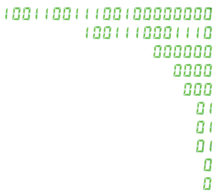

[](https://git.io/typing-svg)
# ~~(__^·>
- I am interested in backend development and cybesec.
- I enjoy participating in and [building/hosting Capture the Flag (CTF)](https://stentors.github.io) competitions.
- I am also interested in [hardware and microelectronics](https://github.com/STENTORS/GPIO).
- Currently working on a flask database project.
- Studing towards an Extended Diploma in Computing.
# Social:
<div align="left">
  <a href="https://linkedin.com/in/ezra-baldwin-stentors"></a>
  <a href="mailto:ezraibaldwin@gmail.com"></a>
  <a href="https://tryhackme.com/r/p/STENTOR"></a>
</div>

# Tech Stack / links:


[](https://github.com/STENTORS/number-plates)

[](https://stentors.github.io)
[](https://stentors.github.io)
[](https://stentors.github.io)
 
[](https://github.com/STENTORS/Unit-18-website)
[](https://beautytoyou.co.uk)

[](https://github.com/STENTORS/Unit-18-website)
[](https://github.com/STENTORS/stocks_game)
 
[](https://www.linkedin.com/in/ezra-baldwin-stentors/details/certifications/)
[](https://github.com/STENTORS/GPIO)

# Stats:
<div align="left">
  
  
  
</div>

# 🐍 Contributions
<picture>
  <source media="(prefers-color-scheme: dark)" srcset="https://raw.githubusercontent.com/stentors/stentors/output/github-snake-dark.svg" />
  <source media="(prefers-color-scheme: light)" srcset="https://raw.githubusercontent.com/stentors/stentors/output/github-snake.svg" />
  
</picture>

```
__|__       _____  _                 _          __                 _                     _               _          
\___/      |_   _|| |_   __ _  _ _  | |__ ___  / _| ___  _ _   ___| |_  ___  _ __  _ __ (_) _ _   __ _  | |__  _  _ 
 | |         | |  | ' \ / _` || ' \ | / /(_-< |  _|/ _ \| '_| (_-<|  _|/ _ \| '_ \| '_ \| || ' \ / _` | | '_ \| || |
 | |         |_|  |_||_|\__,_||_||_||_\_\/__/ |_|  \___/|_|   /__/ \__|\___/| .__/| .__/|_||_||_|\__, | |_.__/ \_, |
 | |                                                                        |_|   |_|            |___/         |__/
_|_|________________________  |  ______________________________________________   . ___________________________ .  __________
                              |                                                  //                             \\
                              |                                                 //                               \\
                            .-'-.                                              //                                 \\
                           ' ___ '                                            //                _._                \\
                 ---------'  .-.  '---------                               .---.              .//|\\.              .---.
 _________________________'  '-'  '_________________________     ________ / .-. \_________..-~ _.-._ ~-..________ / .-. \____
  ''''''-|---|--/    \==][^',_m_,'^][==/    \--|---|-''''''               \ ~-~ /   /H-     `-=.___.=-'     -H\   \ ~-~ /
                \    /  ||/   H   \||  \    /                               ~~~    / H          [H]          H \    ~~~
                 '--'   OO   O|O   OO   '--'                                      / _H_         _H_         _H_ \
                                                                                    UUU         UUU         UUU
```
ART: by Jon Hyatt +
https://asciiart.website

